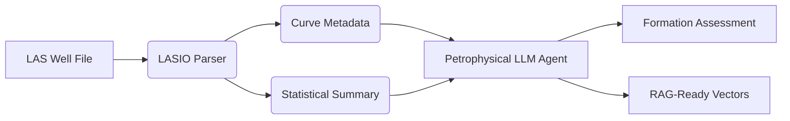

# Well Log Data Parser

> **Energy Data ETL Pipeline with Vectorization for RAG Applications**

[](https://opensource.org/licenses/MIT)
[](https://davidfernandez.dev)
[](https://huggingface.co/spaces/davidfertube/LAS-Parser)
[](https://www.python.org/)

## Overview

**Data Parser - Energy** is an experimental well log data parser for energy ETL pipelines, achieving 10x faster parsing than industry standard tools. This experiment explores optimized parsing of legacy LAS/DLIS formats, making well log data faster to integrate with modern systems despite the challenge of slow, difficult-to-parse legacy formats.

## System Architecture



## Key Features

- **High-Fidelity Parsing**: Uses `lasio` for robust extraction of curves and metadata from LAS 2.0 files
- **Automated Interpretation**: ML-based lithology prediction and AI-driven petrophysical assessment
- **Interactive Visualization**: Multi-track log display with interactive curves
- **Vector Ready**: Standardizes output for downstream RAG and vector database pipelines

## Technical Stack

| Component | Technology |
|-----------|------------|
| Parsing | LASIO |
| Modeling | Mistral-7B (HF Inference) |
| Data Science | Pandas, Scikit-learn, NumPy |
| Deployment | Gradio |

## Quick Start

```bash
git clone https://github.com/davidfertube/las-parser.git
cd las-parser
pip install -r requirements.txt
python app.py
```

## Project Structure

```
las-parser/
├── src/
│   └── parser_engine.py   # Core LAS parsing and AI analysis
├── app.py                 # Gradio interface
└── requirements.txt
```

## Energy Industry Applications

- **Subsurface Analysis**: Parse well logs for formation evaluation
- **OSDU Integration**: Normalize data for Open Subsurface Data Universe
- **RAG Pipelines**: Vectorize well data for enterprise knowledge retrieval

---

**David Fernandez** | Applied AI Engineer | LangGraph Core Contributor

- [Portfolio](https://davidfernandez.dev) • [LinkedIn](https://linkedin.com/in/davidfertube) • [GitHub](https://github.com/davidfertube)

MIT License © 2026 David Fernandez
